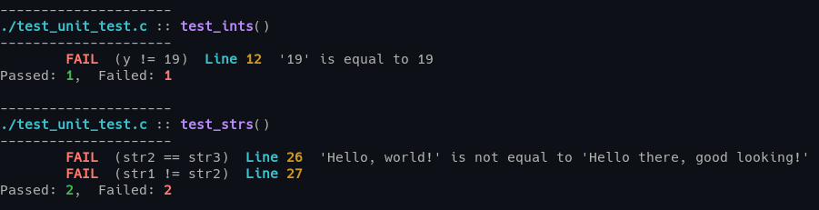

# C Utilities

## Libraries

- __File(s)__: `inc/unit_test.h`
- __Description__: Single header unit testing library
- __Test output__:

 

- __File(s)__: `inc/benchmark.h`
- __Description__: Single header benchmarking library

