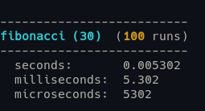

# Utilities
Miscellaneous programming utilities
<br><br>


## Bash scripts

### tmux_workspaces
- Create tmux workspaces
- Example usage:
```bash
source $TMUX_UTILS

SES_NAME="leet"
UTILS_DIR="$HOME/utilities/"
PROJ_DIR="$HOME/git/my_proj/"

create_session "$SES_NAME"

create_window "home" "$HOME"
create_window "utilities" "$UTILS_DIR"
create_split_window "my project" "$PROJ_DIR" "$PROJ_DIR"
create_window "man" "$HOME"

attach_to_session
```
<br>

### cpsc
- Copy the most recent screenshot into the current directory
- Example usage:
```bash
cpsc image_01
```
<br>

### echo_paths
- Print all PATHs
<br>

### kill_port
- Kill process by port number
<br>

### timer
- CLI timer
- Example usage:
```bash
t  2:15:5  
t  1::  "Study"   # 1 hour
t  30  "Sprint"   # 30 seconds
```
<br>


## Singler-header C libraries

### test.h
- Unit testing library
- Example usage:
```c
int passed = 0,
    failed = 0;

test_init();
test_cond     (y != 19, "\'y\' is equal to 19", y);
test_strs_eq  (str2, str3, "\'%s\' is not equal to \'%s\'", str2, str3);
test_strs_neq (str1, str2, " ");
test_results();
```
- Example output (assuming separate test functions et al.):
<p></p>
<br>


### benchmark.h
- Calculates multi-run average in seconds, milliseconds, microseconds
- Example usage:
```c
bm_data_t data;

bm_init (data);
for (int n = 0; n < 100; n++) {
    bm_start (data);
    fibonacci (30);
    bm_stop (data);
}
bm_print_results (data, "fibonacci (30)");

double secs = bm_get_secs (data),
       msecs = bm_get_msecs (data),
       usecs = bm_get_usecs (data);
```
- Example output:
<p></p>
<br>


### bits.h
- Print bits in variable with n bytes
- Example usage:
```c
int num1 = 123456789;
print_bits(num1, sizeof(num1));
```
- Example output:
```bash
00000111 01011011 11001101 00010101
```
<br>
